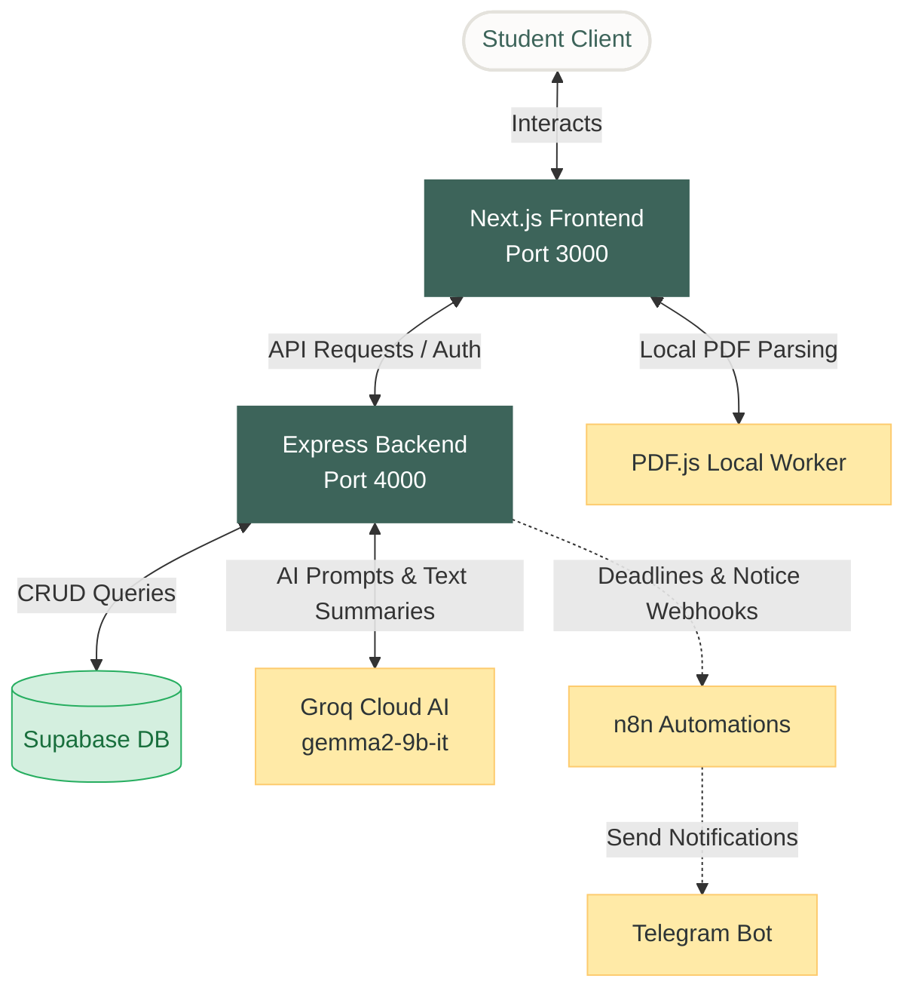
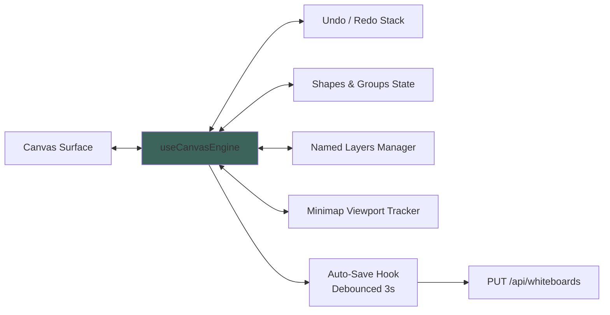
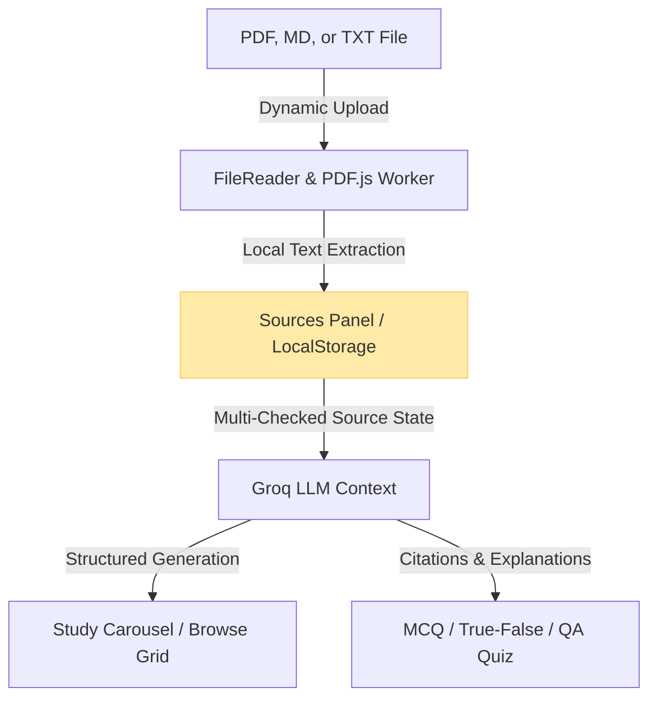

# 🎓 CampusFlow: AI-Powered Student Hub & Study Assistant

CampusFlow is a production-grade, full-stack campus management and cognitive study assistant platform. It combines automated administrative tools (task scheduling, attendance tracking, Telegram notifications, and notice broadcasts) with an interactive **NotebookLM-inspired** cognitive study workspace and a visual **collaboration Whiteboard**.

---

## 🏛️ System Architecture

The following diagram illustrates how the frontend, backend, database layers, and AI services interact:



---

## 🎨 Feature Modules

### 1. ✏️ Visual Collaboration Whiteboard
A lightweight vector diagramming canvas built directly on native HTML5 Canvas APIs, structured for high performance without third-party editor overhead.



* **Interactive Tools**: Freehand Pen (stores points relative to dynamic bounding boxes), Image Insertion (base64 reader), and multi-select Shape Grouping (`Ctrl+G` / `Ctrl+Shift+G`).
* **Layers System**: Sidebar Layer Panel supporting Lock toggles (preventing edits), Visibility toggles, Layer creation, and drag-and-drop reordering.
* **UX Enhancements**: Inline text editing (textarea overlay matching viewport coordinates), scroll-wheel zoom scaling, spacebar panning, and keyboard shortcuts overlay (`ShortcutsPanel`).
* **Data Persistence**: Automatic cloud sync debounced at 3s to Supabase, along with manual JSON and PNG export.

---

### 2. 📚 NotebookLM Study Assistant
A synchronized workspace that maps student-provided course documents into active learning components.



* **Dynamic File Uploads**: Parses `.txt`, `.md`, and `.pdf` files client-side page-by-page using dynamic script-injected CDN PDF.js.
* **Shared Sources Panel**: Stores checked references in synchronized `localStorage`. State updates across both the Flashcard and Quiz pages instantly.
* **3D Study Carousel**: Flashcards that flip dynamically in 3D, supporting keyboard navigation (`Space` to flip, `ArrowLeft/Right` to navigate, `1` / `2` for mastery rating).
* **Comprehensive Quizzing**: Generates Multiple Choice, True/False, or Short Answer questions. Includes a correct answer tracker grid, active score ring, and detailed explanation panels citing document sources.

---

### 3. ⚡ Core Automations & Integrations
* **Notice Summarization**: Summarizes uploaded campus board notifications using AI and schedules instant broadcasts.
* **Telegram Notifications**: Relays task deadlines and urgent notice briefs through custom n8n workflow triggers.
* **Attendance Ledger**: Displays a subject list with class counts, attended ratios, and warning markers indicating if a student falls below the target threshold (e.g. 75%).
* **Task Planner**: Clean planner with priority deadlines, calendar sync, and reminder triggers.

---

## 🛠️ Technology Stack

| Layer | Technologies Used |
|---|---|
| **Frontend** | Next.js 16 (App Router), React 19, TypeScript, Tailwind CSS, Zustand, Lucide Icons, PDF.js |
| **Backend** | Node.js, Express, Supabase JS, Groq SDK |
| **Database** | Supabase (PostgreSQL with UUID Extensions) |
| **Automations** | n8n cloud workflows, Telegram Bot API |
| **Testing** | Vitest (unit tests, math and state checks) |

---

## 🚀 Getting Started

### 1. Prerequisites
* **Node.js** (v18.x or higher)
* **npm** (v10.x or higher)
* A **Supabase** account and project

### 2. Environment Configurations
Create a `.env` file in the `backend/` directory:
```env
SUPABASE_URL=https://your-supabase-id.supabase.co
SUPABASE_SERVICE_ROLE_KEY=your-supabase-service-role-jwt-key
JWT_SECRET=your-secure-jwt-key
PORT=4000
GROQ_API_KEY=your-groq-api-key
N8N_DEADLINE_WEBHOOK=https://your-n8n-url/webhook/deadline
N8N_NOTICE_WEBHOOK=https://your-n8n-url/webhook/notice
TELEGRAM_BOT_TOKEN=your-telegram-token
FRONTEND_URL=http://localhost:3000
```

Create a `.env.local` file in the `frontend/` directory:
```env
NEXT_PUBLIC_SUPABASE_URL=https://your-supabase-id.supabase.co
NEXT_PUBLIC_SUPABASE_ANON_KEY=your-supabase-anon-key
```

### 3. Database Schema Setup
Execute the SQL instructions inside [sql/schema.sql](file:///D:/Project/sql/schema.sql) in your Supabase SQL Editor. This initializes tables and indexes for:
* `students` (user authentication)
* `tasks` & `notices`
* `attendance` & `automation_logs`
* `whiteboards` (canvas document states)

### 4. Running the Development Servers

Start the Backend Server (Express):
```bash
cd backend
npm install
node src/index.js
```

Start the Frontend Server (Next.js):
```bash
cd frontend
npm install
npm run dev
```
Open [http://localhost:3000](http://localhost:3000) in your web browser.

---

## 🧪 Testing

Run the test suite in the frontend directory to verify whiteboard math and coordinates translations:
```bash
cd frontend
npm run test
```
All 63 whiteboard math and shape engine tests will run and output their status.
